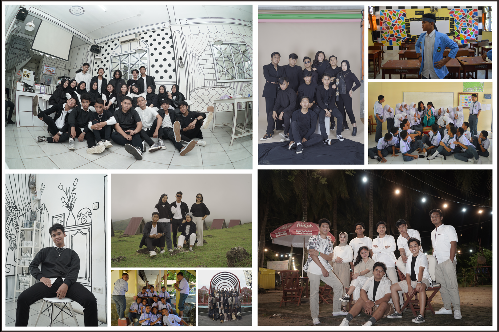

<!DOCTYPE html>
<html lang="en">

<head>
    <meta charset="utf-8" />
    <meta name="viewport" content="width=device-width, initial-scale=1, shrink-to-fit=no" />
    <meta name="description" content="" />
    <meta name="author" content="" />
    <title>Zvml Studios - Studio Foto Kekinian</title>
    <link rel="icon" type="image/x-icon" href="assets/logo.ico" />
    <!-- Core theme CSS (includes Bootstrap)-->
    <link href="css/styles.css" rel="stylesheet" />
</head>

<body id="page-top">
    <!-- Navigation-->
    <nav class="navbar navbar-expand-lg navbar-dark bg-dark fixed-top" id="mainNav">
        

            <a class="navbar-brand" href="#page-top">Z V M L</a>
            <button class="navbar-toggler" type="button" data-bs-toggle="collapse" data-bs-target="#navbarResponsive"
                aria-controls="navbarResponsive" aria-expanded="false" aria-label="Toggle navigation"></button>
            

                <ul class="navbar-nav ms-auto">
                    <li class="nav-item"><a class="nav-link" href="#about">About</a></li>
                    <li class="nav-item"><a class="nav-link" href="#services">Gallery</a></li>
                    <li class="nav-item"><a class="nav-link" href="#contact">Contact</a></li>
                </ul>
            

        

    </nav>
    <!-- Header-->
    <header class="bg-primary bg-gradient text-white">
        

            <h1 class="fw-bolder">Welcome to Zvml Studios</h1>
            
Mengabadiakan setiap momen berharga dalam hidup anda

            <a class="btn btn-lg btn-light" href="#about">Ayoo Mulai!</a>
        

    </header>
    <!-- About section-->
    <section id="about">
        

            

                

                    <h2>About Us</h2>
                    
Zvml Studios membantu Anda mengabadikan momen-momen kebahagiaan Anda dengan
                        teknologi fotografi terkini dan layanan profesional, kami melayani berbagai macam permintaan :
                    

                    <ul>
                        <li>Foto Keluarga</li>
                        <li>Foto Kelulusan</li>
                        <li>Foto Personal</li>
                        <li>Foto Prewedding</li>
                        <li>Dan Berbagai Permintaan Lainnya</li>
                    </ul>
                    
Studio kami dapat anda kunjungi di <a
                            href="https://goo.gl/maps/MyYNsDiwAw3hPD1y5?coh=178572&entry=tt">Zvml Studios Malang</a> Jl.
                        Joyo Suko Gg. I No.25a, Merjosari, Kec. Lowokwaru, Kota Malang, Jawa Timur 65144

                

            

        

    </section> 
    <!-- Services section-->
    <section class="bg-light" id="services">
        

            

                

                    <h2>Our Gallery</h2>
                    
                

            

        

    </section>
    <!-- Contact section-->
    <section id="contact">
        

            

                

                    <h2>Contact us</h2>
                    
Untuk info servis dan booking Anda dapat menghubungi kami via Whatsapp +6282347775981

                

            

        

    </section>
    <!-- Footer-->
    <footer class="py-5 bg-dark">
        

            
since 2019

        

    </footer>
    <!-- Bootstrap core JS-->
    
    <!-- Core theme JS-->
    
</body>

</html>
